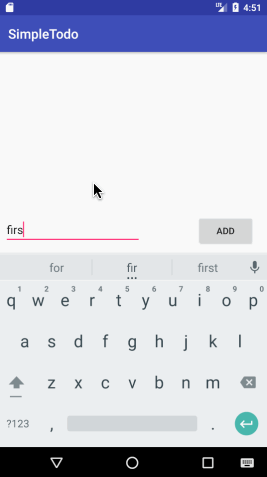

# Pre-work - *Do More*

**Do More** is an android app that allows building a todo list and basic todo items management functionality including adding new items, editing and deleting an existing item.

Submitted by: **Dehang Zheng**

Time spent: **4** hours spent in total

## User Stories

The following **required** functionality is completed:

* [x] User can **successfully add and remove items** from the todo list
* [x] User can **tap a todo item in the list and bring up an edit screen for the todo item** and then have any changes to the text reflected in the todo list.
* [x] User can **persist todo items** and retrieve them properly on app restart

The following **optional** features are implemented:

* [ ] Persist the todo items [into SQLite](http://guides.codepath.com/android/Persisting-Data-to-the-Device#sqlite) instead of a text file
* [ ] Improve style of the todo items in the list [using a custom adapter](http://guides.codepath.com/android/Using-an-ArrayAdapter-with-ListView)
* [ ] Add support for completion due dates for todo items (and display within listview item)
* [ ] Use a [DialogFragment](http://guides.codepath.com/android/Using-DialogFragment) instead of new Activity for editing items
* [ ] Add support for selecting the priority of each todo item (and display in listview item)
* [ ] Tweak the style improving the UI / UX, play with colors, images or backgrounds

The following **additional** features are implemented:

* [ ] List anything else that you can get done to improve the app functionality!

## Video Walkthrough

Here's a walkthrough of implemented user stories:

GIF created with [LiceCap](http://www.cockos.com/licecap/).

## Project Analysis

As part of your pre-work submission, please reflect on the app and answer the following questions below:

**Question 1:** "What are your reactions to the Android app development platform so far? Compare and contrast Android's approach to layouts and user interfaces in past platforms you've used."

**Answer:** 
Fairly straight forward for a simple app like this. I'm typically not very familiar with frontend development so I get the same impression in Android when it comes to layout and designs. 
I feel it's super important to have well designed wireframes when working on mobile app since a great looking UI can go a long way
on a small screen. I also can see lots of challenges when dealing different device versions. Getting a functioning app on the
market would require proper testing among many versions/screen sizes. In addition to screen constraints, mobile development 
is also subject to system resource constraints such as memory, network, processor..etc. 

**Question 2:** "Take a moment to reflect on the `ArrayAdapter` used in your pre-work. How would you describe an adapter in this context and what is its function in Android? Why do you think the adapter is important? Explain the purpose of the `convertView` in the `getView` method of the `ArrayAdapter`."

**Answer:** 
ArrayAdapter is used to allow the data to map to the ListView. It translates the data into views. ConvertView is used as the old view for performance reasons so as ListView loads it can use the old view if possible. 

## Notes

Describe any challenges encountered while building the app.
Layout issues are confusing since I had issues displaying correctly on a smaller screen size. I think it was tougher to work with the layout.xml compared to the concepts we used in the java code. 

## License

    Copyright [2017] [Dehang Zheng]

    Licensed under the Apache License, Version 2.0 (the "License");
    you may not use this file except in compliance with the License.
    You may obtain a copy of the License at

        http://www.apache.org/licenses/LICENSE-2.0

    Unless required by applicable law or agreed to in writing, software
    distributed under the License is distributed on an "AS IS" BASIS,
    WITHOUT WARRANTIES OR CONDITIONS OF ANY KIND, either express or implied.
    See the License for the specific language governing permissions and
    limitations under the License.
